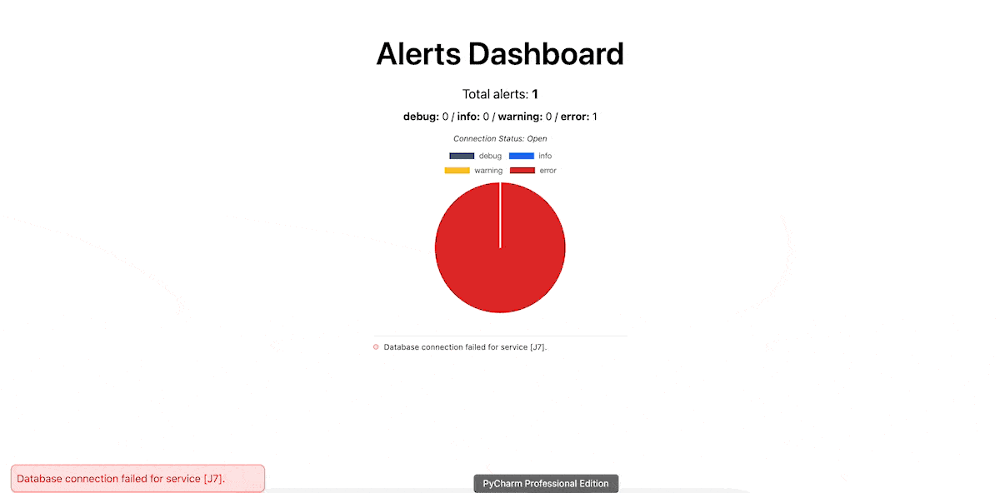

# Watchdog 🐕

### Overview
Watchdog is an open-source project that leverages the power of Go and Kafka to build a robust and scalable alert system.

### Demo


### Getting Started
1. Clone the repository
    ```bash
    git clone https://github.com/NickNaskida/Watchdog.git
    ```

2. Install docker (if you don't have it already)
    - [Docker](https://docs.docker.com/get-docker/)


3. Run the following command to start the project
    ```bash
    docker-compose up --build
    ```

4. Open your browser and navigate to [http://localhost:3000](http://localhost:3000)

### Contributing

Contributions are what make the open source community such an amazing place to learn, inspire, and create. Any
contributions you make are greatly appreciated.

If you have a suggestion that would make this better, please fork the repo and create a pull request. You can also
simply open an issue with the tag "enhancement". Don't forget to give the project a star! Thanks in advance!

In general, we follow the "fork-and-pull" Git workflow

#### How to submit a Pull Request

- Search our repository for open or closed Pull Requests that relate to your submission. You don't want to duplicate
  effort.
- Fork the project on GitHub.
- Create your feature branch
- Do your work. Read the docs to this project.
- Commit your changes (Please use semantic commit
  messages: [Semantic commit messages](https://gist.github.com/joshbuchea/6f47e86d2510bce28f8e7f42ae84c716))
- Push to the branch
- Open a Pull Request and wait for feedback.

🎉 Thank you for your contribution!

### License
This project is licensed under the MIT License - see the [LICENSE](LICENSE) file for details.